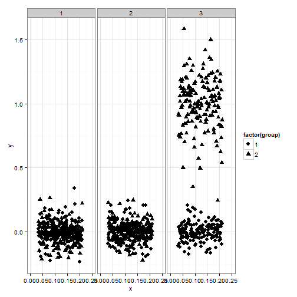
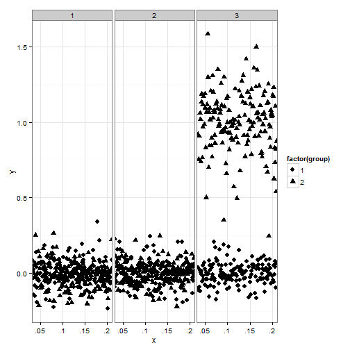
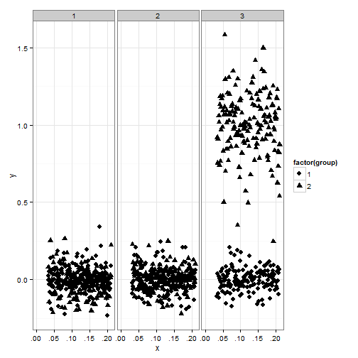

I recently had an occasion while working on a three variable interaction plot for a paper where I wanted to remove the leading 0's in the x-axis text labels using *ggplot2*. This was primarily due to some space concerns I had for the x-axis labels. Unfortunately, I did not find an obvious way to do this in my first go around. After tickering a bit, I've found a workaround. The process is walked through below.

First, some simulated data.

```r
# Sim some data
simdata <- data.frame(x = runif(2400, min = .032, max = .210),
                      y = c(rnorm(2000, mean = 0, sd = .1), 
                            rnorm(400, mean = 1, sd = .25)),
                      group = c(sample(1:2, 1600, replace = TRUE),
                                rep(1, 400), 
                                rep(2, 400)),
                      facet = rep(1:3, each = 800))
```

As shown below, initially there is no group differences, but there are facet differences. Exploring the interaction between the grouping variables shows there is a two variable interaction. Note: This example is not identical to the three variable interaction I originally described above, but assume here that the x variable is also important. 


```r
with(simdata, tapply(y, group, mean))
```

```
##          1          2 
## 0.00342121 0.33040069
```

```r
with(simdata, tapply(y, facet, mean))
```

```
##             1             2             3 
## -0.0009751953  0.0025336609  0.5028529069
```

```r
with(simdata, tapply(y, interaction(group, facet), mean))
```

```
##           1.1           2.1           1.2           2.2           1.3 
##  0.0031464214 -0.0048761903  0.0056148873 -0.0005785326  0.0014837970 
##           2.3 
##  1.0042220169
```

In the example in the paper, I aggregated the unique x values to the third decimal place. That is done with the following *dplyr* code. Note: The data did not need to be aggregated, but it is a bit easier to work with when plotting later.


```r
# round value to .001 and aggregate
simdata$x_rd <- round(simdata$x, 3)

# aggregate
library(dplyr)
simdata_agg <- simdata %>%
  group_by(x_rd, group, facet) %>%
  summarise(y = mean(y))
simdata_agg 
```

```
## Source: local data frame [962 x 4]
## Groups: x_rd, group
## 
##     x_rd group facet            y
## 1  0.032     1     2 -0.088397852
## 2  0.032     2     2  0.228654211
## 3  0.033     1     1 -0.001843538
## 4  0.033     1     2 -0.021662299
## 5  0.033     1     3 -0.110077646
## 6  0.033     2     1  0.080429131
## 7  0.033     2     3  0.915228939
## 8  0.034     1     1  0.025164086
## 9  0.034     1     2 -0.046522430
## 10 0.034     1     3  0.037889712
## ..   ...   ...   ...          ...
```

Now that the data is aggregated, it can be directly plotted with *ggplot2*. This is the base plot that contains the leading 0's by default and treats the x variable as continuous (which it really is continuous).


```r
library(ggplot2)
p <- ggplot(simdata_agg, aes(x = x_rd, y = y, shape = factor(group))) + 
  theme_bw()
p + geom_point(size = 3) + facet_grid(. ~ facet) + 
  scale_x_continuous("x", limits = c(0, .25), 
                     breaks = seq(0, .25, .05))
```

 
The plot above is a good start, but I was worried about the x-axis labels being too close together and ultimately being difficult to read. I decided I wanted to omit the leading 0's to omit some space. This was useful in my scenario as the variable on the x-axis could only take on values between 0 and 1, therefore the leading 0 is not important.

One way to remove the leading 0 is to convert the continuous variable into a character variable and use a simple regular expression (with *gsub*) to remove the 0 at the beginning of the character string. Below is the code to do that and also the resulting plot. The key point of the plotting code below is the use of the *breaks* argument to *scale_x_discrete*. Without this all the unique character values will be plotted, not good.


```r
simdata_agg$x_char <- as.character(simdata_agg$x_rd)
simdata_agg$x_char <- gsub("^0", "", simdata_agg$x_char)
p <- ggplot(simdata_agg, aes(x = x_char, y = y, shape = factor(group))) + 
  theme_bw()
p + geom_point(size = 3) + facet_grid(. ~ facet) + 
  scale_x_discrete("x", breaks = c('.00', '.05', '.1', '.15', '.2', '.25'))
```

 

The plot above has a few flaws. First, there are values at the edge of each facet. This could be fixed with the *expand* argument to *scale_x_discrete*, but I still wanted to include the value of .00 on the x-axis. Secondly, the x-axis text labels are not uniformly formatted which is not ideal (e.g. .1 should be .10).

To fix this, some made up data needs to be added to the data frame. Some care needs to be done here as well as a value of .00 can not just be added to the x variable plotted. This would place a non-uniform gap between .00 and .05 (not shown, but try it for yourself by adapting the code below). Therefore, all values between 0 and .031 need to be manually added to the data frame to keep the spacing uniform. Finally, to not plot the made up values, I created a transparency variable called alpha. This variable was used to set the alpha values to 0 for the made up values and 1 for the real values. *scale_alpha_discrete* was used to specify the range of alpha values, this is important otherwise the made up numbers will show up as a light gray. The final code to manually add the new data is shown below. Anyone have a less workaround procedure?


```r
# Reset aggregation vector
simdata_agg <- simdata %>%
  group_by(x_rd, group, facet) %>%
  summarise(y = mean(y))

# Add values
simdata_agg <- rbind(data.frame(x_rd = seq(0, .031, .001),
                                group = rep(1, 32),
                                facet = rep(1, 32),
                                y = rep(0, 32)),
                     simdata_agg)

# Create a new variable to use for transparent points
simdata_agg$alpha <- ifelse(simdata_agg$x_rd < .032, 0, 1)

# Create x_char variable again
simdata_agg$x_char <- as.character(simdata_agg$x_rd)
simdata_agg$x_char <- gsub("^0", "", simdata_agg$x_char)

# Needed formatting
simdata_agg$x_char <- ifelse(simdata_agg$x_char == '', '.00',
                             simdata_agg$x_char)
simdata_agg$x_char <- ifelse(simdata_agg$x_char == '.2', '.20',
                             simdata_agg$x_char)
simdata_agg$x_char <- ifelse(simdata_agg$x_char == '.1', '.10',
                             simdata_agg$x_char)

# Final plot
p <- ggplot(simdata_agg, aes(x = x_char, y = y, shape = factor(group))) + 
  theme_bw()
p + geom_point(aes(alpha = factor(alpha)), size = 3) + 
  facet_grid(. ~ facet) + 
  scale_x_discrete("x", breaks = c('.00', '.05', '.10', '.15', '.20'),
                   expand = c(.05, .05)) + 
  scale_alpha_discrete(guide = FALSE, range = c(0, 1))
```

 


